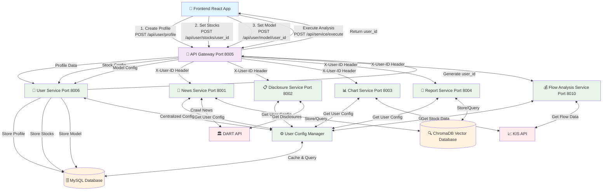

# 📊 주식 분석 시스템 - 데이터 흐름 다이어그램

```mermaid
graph TB
    %% Frontend Layer
    Frontend["📱 Frontend React App"]

    %% API Gateway Layer
    Gateway["🚪 API Gateway Port 8005"]

    %% User Management
    UserService["👤 User Service Port 8006"]
    UserConfigMgr["⚙️ User Config Manager"]

    %% Core Services
    NewsService["📰 News Service Port 8001"]
    DisclosureService["📋 Disclosure Service Port 8002"]
    ChartService["📊 Chart Service Port 8003"]
    ReportService["📑 Report Service Port 8004"]
    FlowService["💰 Flow Analysis Service Port 8010"]

    %% Data Storage
    MySQL[("🗄️ MySQL Database")]
    ChromaDB[("🔍 ChromaDB Vector Database")]

    %% External APIs
    DART["🏛️ DART API"]
    KIS["📈 KIS API"]

    %% Data Flow - User Registration
    Frontend -->|"1. Create Profile<br/>POST /api/user/profile"| Gateway
    Gateway -->|"Profile Data"| UserService
    UserService -->|"Store Profile"| MySQL
    UserService -->|"Generate user_id"| Gateway
    Gateway -->|"Return user_id"| Frontend

    Frontend -->|"2. Set Stocks<br/>POST /api/user/stocks/user_id"| Gateway
    Gateway -->|"Stock Config"| UserService
    UserService -->|"Store Stocks"| MySQL

    Frontend -->|"3. Set Model<br/>POST /api/user/model/user_id"| Gateway
    Gateway -->|"Model Config"| UserService
    UserService -->|"Store Model"| MySQL

    %% Configuration Management
    UserService <-->|"Centralized Config"| UserConfigMgr
    UserConfigMgr <-->|"Cache & Query"| MySQL

    %% Service Execution Flow
    Frontend -->|"Execute Analysis<br/>POST /api/service/execute"| Gateway
    Gateway -->|"X-User-ID Header"| NewsService
    Gateway -->|"X-User-ID Header"| DisclosureService
    Gateway -->|"X-User-ID Header"| ChartService
    Gateway -->|"X-User-ID Header"| ReportService
    Gateway -->|"X-User-ID Header"| FlowService

    %% Services Get User Config
    NewsService <-->|"Get User Config"| UserConfigMgr
    DisclosureService <-->|"Get User Config"| UserConfigMgr
    ChartService <-->|"Get User Config"| UserConfigMgr
    ReportService <-->|"Get User Config"| UserConfigMgr
    FlowService <-->|"Get User Config"| UserConfigMgr

    %% Data Sources
    NewsService <-->|"Crawl News"| DART
    DisclosureService <-->|"Get Disclosures"| DART
    ChartService <-->|"Get Stock Data"| KIS
    FlowService <-->|"Get Flow Data"| KIS

    %% Vector Storage
    NewsService <-->|"Store/Query"| ChromaDB
    ReportService <-->|"Store/Query"| ChromaDB

    %% Styling
    classDef frontend fill:#e1f5fe
    classDef gateway fill:#f3e5f5
    classDef service fill:#e8f5e8
    classDef database fill:#fff3e0
    classDef external fill:#ffebee

    class Frontend frontend
    class Gateway gateway
    class UserService,NewsService,DisclosureService,ChartService,ReportService,FlowService,UserConfigMgr service
    class MySQL,ChromaDB database
    class DART,KIS external
```
